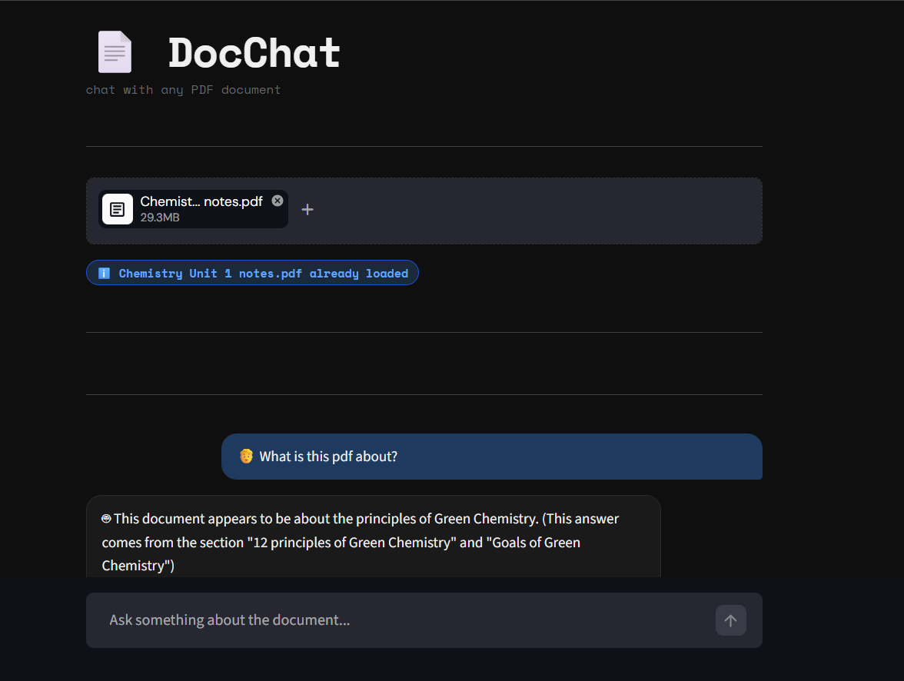
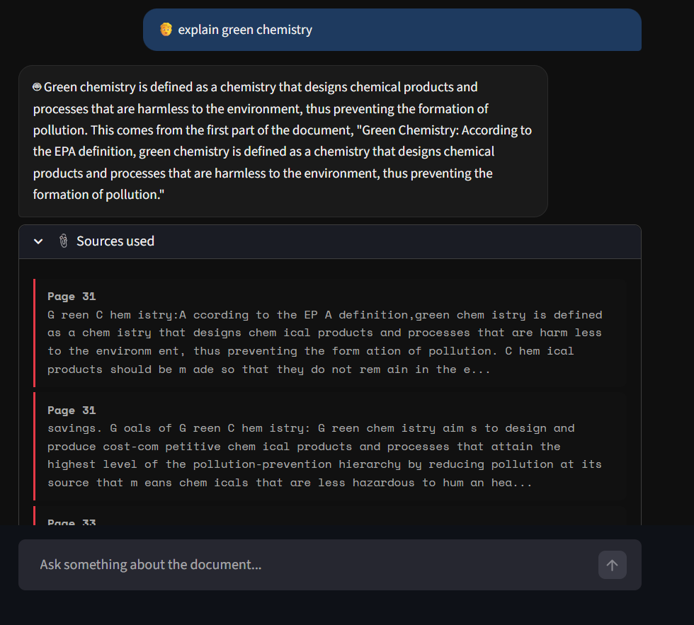
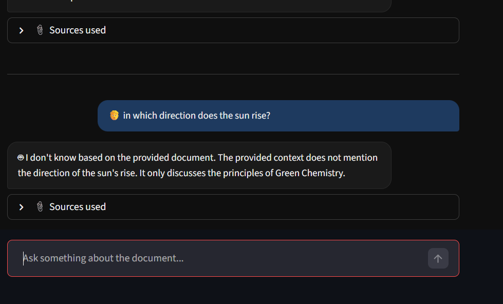

# 📄 DocChat — Chat with any PDF

DocChat is a RAG (Retrieval-Augmented Generation) powered web app that lets you have a conversation with any PDF document. Upload a file, ask questions, and get answers grounded in the actual document content — with exact page citations.

Built with LangChain, FAISS, Groq (LLaMA 3.3 70B), and Streamlit.

---

## 🚀 Demo





> Upload a PDF → Ask questions → Get answers with page citations

---

## 🧠 How it works

1. **PDF Loading** — Reads the uploaded PDF using `PyPDFLoader`, preserving page metadata
2. **Chunking** — Splits content into overlapping chunks using `RecursiveCharacterTextSplitter`
3. **Embedding** — Converts each chunk into a semantic vector using `sentence-transformers/all-MiniLM-L6-v2`
4. **Vector Store** — Stores all vectors in a FAISS index for fast similarity search
5. **Retrieval** — When you ask a question, the top 4 most relevant chunks are retrieved
6. **Generation** — Retrieved chunks + your question are sent to LLaMA 3.3 70B (via Groq) to generate a grounded, page-cited answer

---

## 🛠️ Tech Stack

| Tool | Purpose |
|------|---------|
| Streamlit | Web UI |
| LangChain | RAG orchestration |
| FAISS | Vector similarity search |
| Groq (LLaMA 3.3 70B) | LLM for answer generation |
| sentence-transformers | Text embeddings |
| PyPDFLoader | PDF text extraction |

---

## ⚙️ Setup & Installation

### 1. Clone the repo
```bash
git clone https://github.com/kforkandarp/DocumentRAG.git
cd YOURREPONAME
```

### 2. Create and activate a virtual environment
```bash
python -m venv venv

# Windows
venv\Scripts\activate

# Mac/Linux
source venv/bin/activate
```

### 3. Install dependencies
```bash
pip install -r requirements.txt
```

### 4. Get a Groq API key
- Sign up at [console.groq.com](https://console.groq.com)
- Go to **API Keys** → **Create API Key**
- Copy the key

### 5. Create a `.env` file
Create a file called `.env` in the project root:
```
GROQ_API_KEY=your_actual_key_here
```

### 6. Run the app
```bash
streamlit run pdfchat.py
```

The app will open automatically at `http://localhost:8501`

---

## 📁 Project Structure

```
docchat/
├── pdfchat.py      # Main Streamlit application
├── requirements.txt
├── .env            # Your API key (never committed to Git)
└── .gitignore      # Ignores .env, venv/ etc.
```

---

## 💡 Use Cases

- Chat with research papers and extract key findings
- Query financial reports and invoices
- Ask questions about legal documents
- Study from lecture notes or textbooks

---

## ⚠️ Known Limitations

- Only works with text-based PDFs (scanned/image PDFs have no extractable text)
- Answer quality depends on PDF text quality
- Free Groq tier has rate limits

---

## 📄 License

MIT License — feel free to use, modify, and share.
